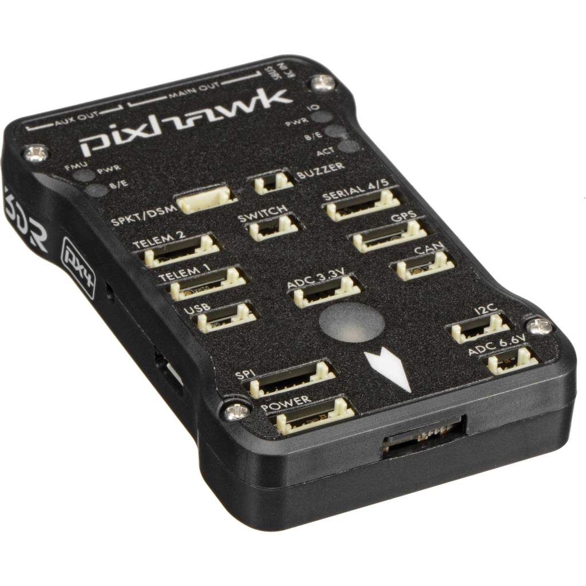

# Sensors

 

in this project we implemented the basic infrastructure for robot sampling the sensors info via mavlink to Pixhawk.
This module is all about getting the info from the pixhawk(sensors device) and deliver it to the sql server using different querys.

## Further Work
update sensors info tables in sql config for future needs and implement faster sampling using multi-threaded functions
